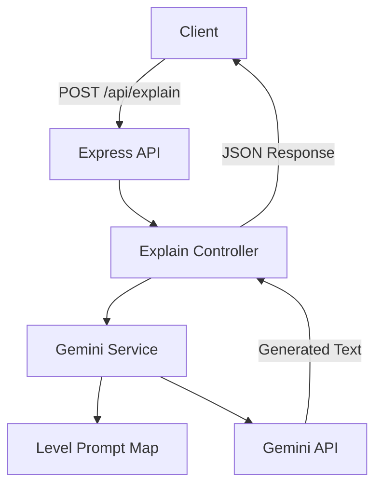

# ToddlerToPhD

<p align="center">
  <em>An AI-powered explanation API and web app that adjusts any topic across three comprehension levels — Toddler, Teenager, and Expert — using the Gemini API.</em>
</p>

<p align="center">
  
  
  
  
  
  
  
</p>

<p align="center">
  
</p>

---

## About

**ToddlerToPhD** is a full-stack AI application that explains any topic at three distinct comprehension levels — Toddler, Teenager, and Expert.

Instead of a single static explanation, the app dynamically constructs a level-specific prompt and sends it to the Gemini API, so the same topic can be re-explained at a different depth instantly, without retyping.

This project follows a modular architecture using Express, React, Tailwind CSS, and the Gemini API.

---

# Features

| Feature | Status |
|----------|--------|
| Topic Input & Level Selector (Toddler / Teenager / Expert) | ✅ |
| Level-Specific Prompt Engineering | ✅ |
| Instant Level Switching (same topic, new depth) | ✅ |
| Split Ask / Answer Layout with Internal Scroll | ✅ |
| Background & Accent Color Adapts per Level | ✅ |
| Loading & Error States | ✅ |
| Modular Service Architecture | ✅ |

---

# Tech Stack

| Layer | Technology |
|--------|------------|
| Runtime | Node.js |
| Framework | Express.js |
| Frontend | React + Vite |
| Styling | Tailwind CSS |
| AI Engine | Google Gemini API (`@google/genai`) |
| Icons | lucide-react |
| Environment | dotenv |

---

#  Project Architecture



---

# 📂 Project Structure

```text
ToddlerToPhD

│

├── backend
│   ├── public
│   ├── src
│   │   ├── controllers
│   │   ├── middlewares
│   │   ├── routes
│   │   ├── services
│   │   └── utils
│   │
│   ├── .env.sample
│   └── package.json
│
├── frontend
│   ├── src
│   │   ├── assets
│   │   ├── components
│   │   ├── App.jsx
│   │   └── main.jsx
│   │
│   └── package.json
│
├── postman
│   └── ToddlerToPhD.postman_collection.json
│
├── screenshots
│   ├── toddlerLevel.png
│   ├── teenagerLevel.png
│   └── expertLevel.png
│
└── README.md
```

---

#  Explanation Flow

## Requesting an Explanation

```text
User

↓

Enter Topic

↓

Select Level

↓

Map Level to Prompt Instruction

↓

Merge Instruction + Topic

↓

Send to Gemini API

↓

Return Explanation

↓

Render in Answer Panel
```

---

## Switching Levels

```text
User

↓

Click a Different Level Tab

↓

Same Topic Re-Submitted

↓

New Level-Specific Prompt Built

↓

New Explanation Returned
```

---

#  Environment Variables

Create a `.env` file.

```env
PORT=
CORS_ORIGIN=
GEMINI_API_KEY=
```

---

# 🚀 Getting Started

## Clone

```bash
git clone https://github.com/Radhikagupta25/ToddlerToPhD.git
```

# Environment Setup
```bash
cd backend
cp .env.sample .env
```

# Populate .env with following environment variables:
```bash
PORT=
CORS_ORIGIN=
GEMINI_API_KEY=
FRONTEND_URL=
```

# Install & Run

```bash
# Backend
cd backend
npm install
npm run dev

# Frontend
cd ../frontend
npm install
npm run dev
```

# Accessing the App
Once both servers are running, the API will be available at:
```bash
http://localhost:8000
```

The frontend will be available at:
```bash
http://localhost:5173
```

---

# 📮 API Collection

A complete Postman collection is included for testing every endpoint.

```
postman/
    ToddlerToPhD.postman_collection.json
```

Included requests:

### Explain

- Explain Topic (Toddler)
- Explain Topic (Teenager)
- Explain Topic (Expert)

---

# 📡 API Endpoints

### Explain

```
POST   /api/explain
```

---

#  Why this Project?

✔ Real Prompt Engineering Across Multiple Complexity Tiers

✔ Level-Aware, Reusable AI Service Layer

✔ Clean Ask/Answer UI with Internal Scroll (no page-jump)

✔ Modular Controller/Service Architecture

✔ Easy to Extend into RAG, Streaming, or Auth

---

# 🤝 Contributing

Contributions are always welcome!

If you'd like to improve this project:

1. Fork the repository

2. Create a feature branch

```bash
git checkout -b feature/your-feature
```

3. Commit your changes

```bash
git commit -m "feat: add your feature"
```

4. Push your branch

```bash
git push origin feature/your-feature
```

5. Open a Pull Request

Whether it's fixing a bug, improving documentation, or adding a feature, every contribution is appreciated.

---

#  Before Opening a Pull Request

- [ ] Project builds successfully
- [ ] Code follows existing style
- [ ] No sensitive information committed
- [ ] Environment variables documented
- [ ] Tested locally

---

#  Roadmap

- [ ] Streaming Responses (SSE)
- [ ] Structured JSON Output (explanation, analogy, fun fact)
- [ ] MongoDB-Backed Response Caching
- [ ] JWT Authentication + Saved History
- [ ] "Explain this Document" — RAG Pipeline
- [ ] Docker Support
- [ ] Unit Testing
- [ ] CI/CD Pipeline

---

# 📄 License

This project is licensed under the MIT License.

---

#  Support

If you found this project useful:

⭐ Star the repository

🍴 Fork it

🐞 Open Issues

🚀 Submit Pull Requests

---

<p align="center">

Built with ❤️ by <b>Radhika Gupta</b>

If this project saved you time, consider giving it a ⭐ on GitHub.

</p>
