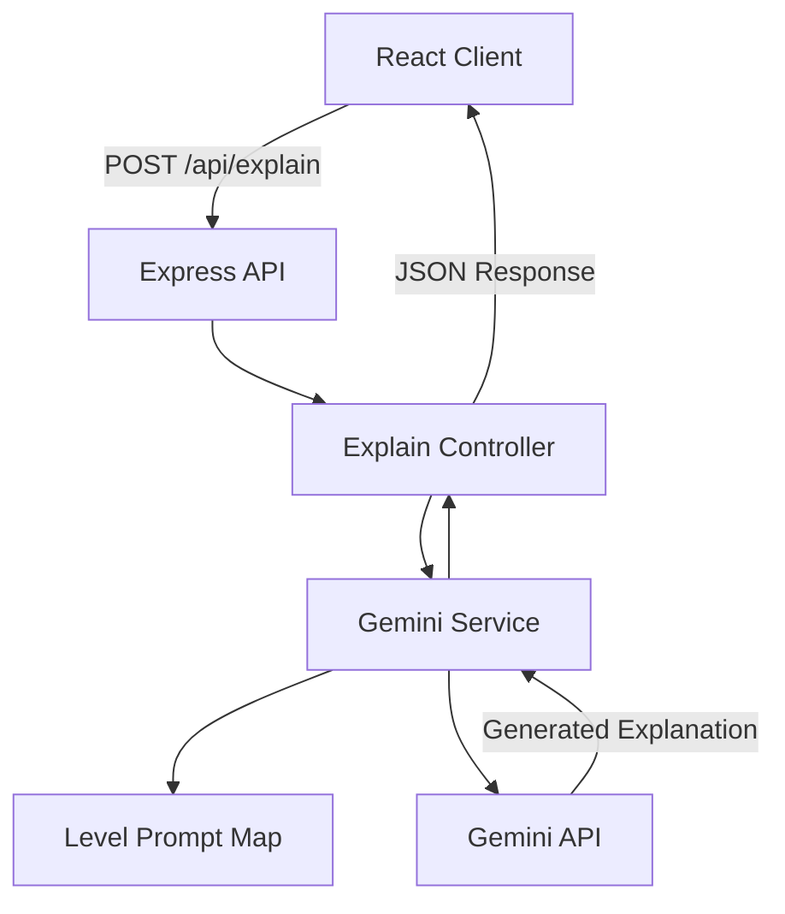

# ToddlerToPhD

<p align="center">
  <em>
    An AI-powered explanation API and web app that transforms any topic across
    three comprehension levels — Toddler, Teenager, and Expert — using the Gemini API.
  </em>
</p>

<p align="center">
  
  
  
  
  
  
  
</p>

<p align="center">
  
</p>

<p align="center">
  <a href="https://toddler-to-ph-d.vercel.app/">
    <strong>🚀 Live Demo</strong>
  </a>
</p>

---

## About

**ToddlerToPhD** is a full-stack AI application that explains any topic at three distinct comprehension levels — **Toddler, Teenager, and Expert**.

Instead of producing a single static explanation, the application dynamically constructs a level-specific prompt and sends it to the **Gemini API**.

Users can instantly switch between comprehension levels while keeping the same topic, allowing the same concept to be re-explained with different vocabulary, depth, and technical complexity.

The project follows a modular full-stack architecture using **React, Vite, Tailwind CSS, Node.js, Express, and the Gemini API**.

---

#  Features

| Feature | Status |
|----------|--------|
| Topic Input & Level Selector | ✅ |
| Toddler / Teenager / Expert Modes | ✅ |
| Level-Specific Prompt Engineering | ✅ |
| Instant Level Switching | ✅ |
| Split Ask / Answer Interface | ✅ |
| Scrollable Explanation Panel | ✅ |
| Level-Adaptive Background & Accent Colors | ✅ |
| Loading States | ✅ |
| Error Handling | ✅ |
| Modular Controller & Service Architecture | ✅ |
| Gemini API Integration | ✅ |
| Production Deployment | ✅ |

---

#  Tech Stack

| Layer | Technology |
|-------|------------|
| Runtime | Node.js |
| Backend Framework | Express.js |
| Frontend | React + Vite |
| Styling | Tailwind CSS |
| AI Engine | Google Gemini API (`@google/genai`) |
| Icons | lucide-react |
| Environment Configuration | dotenv |
| Frontend Deployment | Vercel |
| Backend Deployment | Render |

---

#  Project Architecture



### Production Architecture

```text
User
  │
  ▼
React + Vite
Vercel
  │
  │ POST /api/explain
  ▼
Express API
Render
  │
  ▼
Gemini Service
  │
  ▼
Google Gemini API
  │
  ▼
Generated Explanation
  │
  ▼
React UI
```

---

#  Project Structure

```text
ToddlerToPhD
│
├── backend
│   ├── public
│   │
│   ├── src
│   │   ├── controllers
│   │   ├── middlewares
│   │   ├── routes
│   │   ├── services
│   │   └── utils
│   │
│   ├── .env.sample
│   └── package.json
│
├── frontend
│   ├── src
│   │   ├── assets
│   │   ├── components
│   │   ├── App.jsx
│   │   └── main.jsx
│   │
│   ├── .env.sample
│   └── package.json
│
├── postman
│   └── ToddlerToPhD.postman_collection.json
│
├── screenshots
│   ├── toddlerLevel.png
│   ├── teenagerLevel.png
│   └── expertLevel.png
│
└── README.md
```

---

#  How It Works

## Requesting an Explanation

```text
User
  │
  ▼
Enter Topic
  │
  ▼
Select Comprehension Level
  │
  ▼
Level → Prompt Instruction
  │
  ▼
Prompt Instruction + Topic
  │
  ▼
Gemini API
  │
  ▼
Generated Explanation
  │
  ▼
Answer Panel
```

The backend maps the selected comprehension level to a dedicated prompt instruction before sending the request to Gemini.

This allows the AI behavior to be controlled by the application instead of relying entirely on the user's prompt.

---

## Switching Levels

Users do not need to re-enter their topic when they want a different explanation.

```text
Existing Topic
     │
     ▼
Select New Level
     │
     ▼
New Level-Specific Prompt
     │
     ▼
Gemini API
     │
     ▼
New Explanation
```

For example:

```text
Topic: Quantum Computing

Toddler
→ Simple intuition and analogy

Teenager
→ Accessible explanation with core concepts

Expert
→ Technical terminology and deeper reasoning
```

---

#  Environment Variables

The frontend and backend use **separate environment configurations**.

---

## Backend Environment

Create:

```text
backend/.env
```

Add:

```env
PORT=8000
CORS_ORIGIN=http://localhost:5173
GEMINI_API_KEY=your_gemini_api_key
```

### Variables

| Variable | Description |
|----------|-------------|
| `PORT` | Port used by the Express server during local development |
| `CORS_ORIGIN` | Frontend origin allowed to access the backend API |
| `GEMINI_API_KEY` | API key used by the backend to communicate with Gemini |

The sample file should contain:

```text
backend/.env.sample
```

```env
PORT=
CORS_ORIGIN=
GEMINI_API_KEY=
```

> `GEMINI_API_KEY` must remain server-side and must never be exposed to the React application.

---

## Frontend Environment

Create:

```text
frontend/.env
```

Add:

```env
VITE_BACKEND_URL=http://localhost:8000
```

### Variables

| Variable | Description |
|----------|-------------|
| `VITE_BACKEND_URL` | Base URL of the Express backend |

The sample file should contain:

```text
frontend/.env.sample
```

```env
VITE_BACKEND_URL=
```

The frontend accesses it using:

```javascript
const API_URL = import.meta.env.VITE_BACKEND_URL;
```

> Vite only exposes environment variables prefixed with `VITE_` to frontend code.

---

#  Getting Started

## 1. Clone the Repository

```bash
git clone https://github.com/Radhikagupta25/ToddlerToPhD.git
cd ToddlerToPhD
```

---

## 2. Backend Setup

Navigate to the backend:

```bash
cd backend
```

Install dependencies:

```bash
npm install
```

Create your environment file:

```bash
cp .env.sample .env
```

Configure:

```env
PORT=8000
CORS_ORIGIN=http://localhost:5173
GEMINI_API_KEY=your_gemini_api_key
```

Start the development server:

```bash
npm run dev
```

The backend will be available at:

```text
http://localhost:8000
```

---

## 3. Frontend Setup

Open another terminal and navigate to:

```bash
cd frontend
```

Install dependencies:

```bash
npm install
```

Create the frontend environment file:

```bash
cp .env.sample .env
```

Configure:

```env
VITE_BACKEND_URL=http://localhost:8000
```

Start Vite:

```bash
npm run dev
```

The frontend will be available at:

```text
http://localhost:5173
```

---

# 📡 API Reference

## Generate Explanation

```http
POST /api/explain
```

### Request Body

```json
{
  "topic": "Quantum Computing",
  "level": "teenager"
}
```

Supported levels:

```text
toddler
teenager
expert
```

### Example Response

```json
{
  "explanation": "Generated explanation..."
}
```

---

#  Postman Collection

A Postman collection is included for testing the API independently from the frontend.

```text
postman/
└── ToddlerToPhD.postman_collection.json
```

Included requests:

- Explain Topic — Toddler
- Explain Topic — Teenager
- Explain Topic — Expert

---

#  Deployment

ToddlerToPhD uses separate deployments for the frontend and backend.

```text
GitHub
   │
   ├───────────────┐
   ▼               ▼
frontend/        backend/
   │               │
   ▼               ▼
Vercel           Render
   │               │
   └──────► API ◄──┘
                   │
                   ▼
               Gemini API
```

---

## Frontend — Vercel

The React/Vite frontend is deployed using Vercel.

Production environment:

```env
VITE_BACKEND_URL=YOUR_RENDER_BACKEND_URL
```

### Live Application

```text
YOUR_VERCEL_URL
```

---

## Backend — Render

The Express backend is deployed using Render.

Production environment:

```env
CORS_ORIGIN=YOUR_VERCEL_URL
GEMINI_API_KEY=your_gemini_api_key
```

Render provides the production `PORT` environment variable automatically, so it does not need to be manually configured.

The server should use:

```javascript
const PORT = process.env.PORT || 8000;
```

---

#  Security Notes

The Gemini API key exists **only on the backend**.

```text
Browser
   │
   │ topic + level
   ▼
Express Backend
   │
   │ GEMINI_API_KEY
   ▼
Gemini API
```

The frontend never communicates directly with Gemini and never receives the API key.

Important practices used by the project:

- Environment-based configuration
- Server-side API key management
- CORS restrictions
- Input handling through the backend API
- Separate frontend and backend deployment environments
- No secrets committed to source control

---

#  Why This Project?

ToddlerToPhD demonstrates more than simply calling an AI API.

### Level-Aware Prompt Engineering

The backend controls how Gemini explains a topic based on the selected comprehension level.

### Reusable AI Service Layer

Gemini-specific logic is separated from controllers, making the AI integration easier to maintain and extend.

### Full-Stack AI Integration

```text
React
  ↓
Express
  ↓
Prompt Engineering
  ↓
Gemini
```

### Adaptive User Experience

Each comprehension level changes the visual identity of the interface while preserving the same interaction model.

### Extensible Architecture

The existing architecture can be extended with:

- Streaming
- Authentication
- Response caching
- History
- RAG
- Document explanation
- Structured AI output

---

# 🗺️ Roadmap

- [ ] Streaming Responses with SSE
- [ ] Structured JSON Output
- [ ] Explanation + Analogy + Fun Fact
- [ ] MongoDB-Backed Response Caching
- [ ] JWT Authentication
- [ ] Saved Explanation History
- [ ] Explain This Document — RAG Pipeline
- [ ] Docker Support
- [ ] Unit & Integration Testing
- [ ] CI/CD Pipeline

---

# 🤝 Contributing

Contributions are welcome.

## 1. Fork the Repository

Fork ToddlerToPhD to your GitHub account.

## 2. Create a Feature Branch

```bash
git checkout -b feature/your-feature
```

## 3. Commit Your Changes

```bash
git commit -m "feat: add your feature"
```

## 4. Push the Branch

```bash
git push origin feature/your-feature
```

## 5. Open a Pull Request

Bug fixes, documentation improvements, UI enhancements, and new features are welcome.

---

# ✅ Before Opening a Pull Request

- [ ] Project builds successfully
- [ ] Feature has been tested locally
- [ ] Code follows the existing project structure
- [ ] No API keys or sensitive information are committed
- [ ] New environment variables are documented
- [ ] Existing functionality remains intact

---

# 📄 License

This project is licensed under the **MIT License**.

---

# ⭐ Support

If you found ToddlerToPhD useful:

⭐ Star the repository

🍴 Fork the project

🐞 Report bugs through Issues

🚀 Submit improvements through Pull Requests

---

<p align="center">
  Built with ❤️ by <b>Radhika Gupta</b>
</p>

<p align="center">
  If this project helped you, consider giving it a ⭐ on GitHub.
</p>
